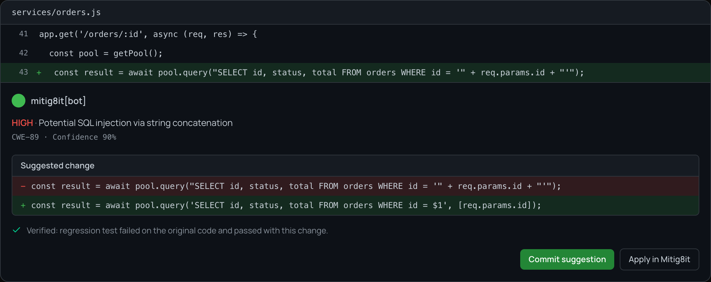

# Mitig8it

[](https://github.com/aicodesentry/mitig8it/actions/workflows/ci.yml)
[](LICENSE)

Mitig8it reviews every pull request for exploitable code and posts the fix underneath the finding,
as a suggestion you commit in one click.

The idea is one sentence long and the whole product is an attempt to earn it. Find the issue, write
the fix, and then prove it: generate a regression test for that specific finding, run it against
the original code and require it to fail, apply the repair and require it to pass. Only a fix that
survives that gets posted, as a GitHub suggestion block under the line it repairs. Nothing merges
automatically, and the App holds no write access to your code: the suggestion becomes a commit when
you click **Commit suggestion**, and there is no code path that could do it for you.



## Try it

Add this file to a repository as `.github/workflows/mitig8it.yml`:

```yaml
name: Security review
on: pull_request
permissions:
  contents: read
  pull-requests: write
  checks: write
jobs:
  review:
    runs-on: ubuntu-latest
    steps:
      - uses: actions/checkout@v4
      - uses: aicodesentry/mitig8it/action@main
```

That is the whole installation, and to remove it you delete the file. It runs in your own runner
with your workflow's own token, and nothing leaves the runner. Inputs, permissions and what changes
if you supply a model key: [action/README.md](action/README.md).

The hosted GitHub App at [mitig8it.com](https://mitig8it.com) runs the same pipeline on our
infrastructure and adds what needs a database: a dashboard, per-repository history, suppressions
and baselines.

## Numbers

Measured in September 2026. Every cell links to the run that produced it.

| What | Measured | Read it as |
| --- | --- | --- |
| Precision of findings that post | [0.67 to 0.97](docs/validation/vulnerable-corpus-2026-09.md#precision-before-and-after) | 172 findings adjudicated by hand across 23 vulnerable repositories. 0.67 for everything the scanner produces, 0.97 for what posts once the five worst tier 1 rules are quarantined. |
| Recall on labelled vulnerabilities | [0.40 to 0.58](docs/validation/vulnerable-corpus-2026-09.md#recall) | Of 171 labelled vulnerabilities, 100 produced a finding on the labelled line. This is the weak half. |
| Findings on clean code | [134 over 165 pull requests](docs/validation/real-repo-replay-2026-09.md) | Merged pull requests from 11 public libraries with no known vulnerability, 816 changed files. 30 of the 134 findings were read by hand and 29 were wrong, which is why five tier 1 rules are now quarantined. |
| Tier 2 rules | [130, of which 124 post](docs/validation/tier2-coverage-2026-09.md) | Up from 25. Six are quarantined on their own measured precision. All written in-house, because [the public rule libraries forbid use in a paid service](docs/legal/third-party-rules.md). |
| The Action on real repositories | [63 of 65 comments](docs/validation/action-trial-2026-09.md) | Installed on private copies of ten real repositories: 65 inline comments, 63 true positives, 1 false positive, 1 unsure. |
| Evaluation corpus | [55 fixtures](benchmarks/remediation/README.md) | 43 repairs verified and 12 correct abstentions, under both the reference and engine-local adapters, with no unexpected failures. |
| Verified fixes on real vulnerable code | [8](docs/validation/vulnerable-corpus-2026-09.md#after-typescript-and-module-scope) | Out of 245 findings in a supported family. The proof is the binding constraint, not the patch. |

A 100% pass rate from the evaluation corpus is not a quality claim, and the reasons are written
down beside it. [docs/validation/README.md](docs/validation/README.md) says how to read each of
these.

## How it works

1. A pull request arrives. The changed files are fetched, filtered by `.mitig8it.yml`, and capped
   at 200 files.
2. Tier 1 is regex rules over the diff. Tier 2 is AST rules over the file, in 130 in-house
   patterns. A rule whose measured precision is below 0.8 over at least three adjudicated findings
   is quarantined: it still runs and is still counted, and nothing it produces reaches you.
3. Findings are deduplicated, clustered and fingerprinted, so the same issue does not arrive twice.
4. For a finding in one of five repair families, the engine writes a patch and a regression test,
   and runs the test on the original tree and on the repaired one. It refuses rather than guessing:
   the refusal reasons are the useful output, and they are counted.
5. What survives is posted: an inline comment per finding, a suggestion block per proven fix, and
   one check run. A re-run edits its own previous comments rather than posting beside them.

Why the proof exists, what it establishes and what it does not:
[docs/design/prove-before-post.md](docs/design/prove-before-post.md).

## What it does not do yet

- **Eight verified fixes on real vulnerable code.** Of 245 corpus findings in a supported family,
  the template patches 33 and the engine proves 37; 8 verify end to end, and all eight are
  hardcoded credentials. Two structural obstacles were removed this month and the count did not
  move either time. The constraint is the proof: 60 of the refusals are sinks that run at import
  from a value no test can set, where refusing is the right answer.
- **Recall is the weak half, and it is uneven by class.** Deserialization and dynamic code
  execution are near 1.00. Cross-site scripting reaches 26 of 32 labels but only 18 of those come
  from rules allowed to post; path traversal is 7 of 14. A maintainer who reads a clean review and
  concludes the file is clean would be wrong about half the time.
- **Repair verification is development-grade.** Tests run as ordinary subprocesses with no network,
  kernel or filesystem isolation, in the App and the Action alike. Every candidate is
  `development_unverified` and every comment says "development sandbox". The isolated job is
  written and not yet proven to run.
- **JavaScript, TypeScript and Python only**, plus 16 template extensions for tier 2. Five repair
  families: `sql_parameterization`, `command_arguments`, `path_containment`,
  `hardcoded_credential`, `code_injection_eval`.
- **Informational findings are not posted**, and a finding on a line the pull request did not touch
  has nowhere to go: GitHub rejects an inline comment there. In the ten-repository trial that was
  28 of 93 findings, counted in the summary and visible nowhere else. It is a defect and it is
  open.

Everything open, grouped: [ROADMAP.md](ROADMAP.md). Deliberately deferred engineering debt:
[docs/architecture/known-debt.md](docs/architecture/known-debt.md).

## Reproduce the numbers

```sh
make deps && make bench
```

Python 3.11, Node 22 or later, no database, no credentials, no model key. It runs the tier 1 and
tier 2 precision gates and the evaluation corpus under both adapters, and prints one table. The
dated reference output to compare against is in
[docs/validation/README.md](docs/validation/README.md).

`make test` runs every suite. The corpus and replay measurements are larger than one command:
they download 23 third-party repositories and replay 165 pull requests, and each document names
the command that reproduces it.

## Repository layout

| Path | What is in it |
| --- | --- |
| `action/` | The GitHub Action: orchestrator, publisher, image. |
| `services/api-service/` | Control plane: auth, webhooks, REST API, migrations. |
| `services/github-service/` | GitHub App adapter: files, comments, check runs. |
| `services/analysis-service/` | Detection. Tier 1 rules, tier 2 rule packs, clustering. |
| `services/remediation-service/` | Repair: templates, proof generation, sandbox, agent loop. |
| `frontend/` | The dashboard. |
| `benchmarks/` | Precision gates and the remediation evaluation corpus. |
| `scripts/replay/` | The harness that replays real pull requests. |
| `docs/validation/` | Every measurement, with the run that produced it. |
| `docs/history/` | Dated reviews, kept as written and not maintained. |

A fuller description of each component and its interfaces is in
[docs/reference/system-overview.md](docs/reference/system-overview.md).

## Contributing

[CONTRIBUTING.md](CONTRIBUTING.md) covers running the tests and benchmarks, adding a rule with the
measurement the posting policy needs, adding a fixture, and adding a repair family. Eight bounded
starting points are in
[docs/contributing/good-first-issues.md](docs/contributing/good-first-issues.md). A false positive
is the most useful thing you can report, and there is a form for it.

[CODE_OF_CONDUCT.md](CODE_OF_CONDUCT.md) applies.

## Security

Report a vulnerability in Mitig8it to support@mitig8it.com, not to the issue tracker.
[SECURITY.md](SECURITY.md) says what is in scope and what to expect.

## License

[Apache-2.0](LICENSE).
