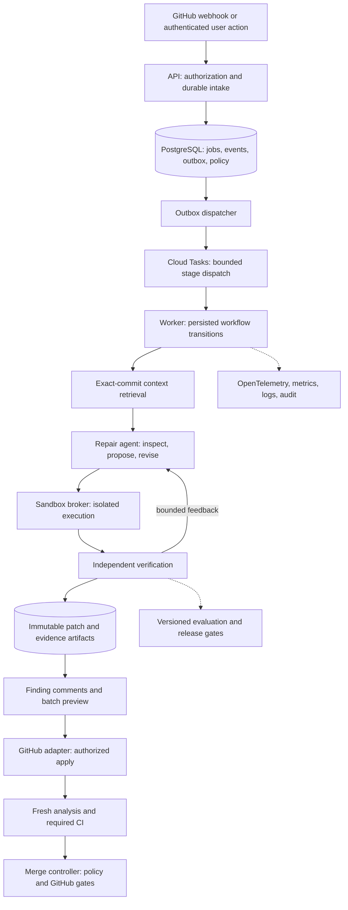

# Mitig8it: agentic remediation implementation plan

Date: 2026-09-15
Status: implementation specification; no infrastructure or product changes applied by this document.

> Superseded in part. This document specified an in-app apply that committed to the pull
> request branch, and a merge controller behind an operator flag. Both were removed by
> the least-privilege change: the GitHub App no longer holds write access to repository
> contents, so it cannot commit to a branch or merge a pull request, and no flag can
> restore either. A verified fix is published as a GitHub suggestion block and applied by
> a developer with GitHub's own "Commit suggestion" button, under that developer's
> identity. Sections 1, 6 (the apply and merge endpoints) and the W12 row are read as
> history; everything about generation, verification, evidence and publication still
> describes the system. See [the progress ledger](agentic-remediation-progress.md).

## 1. Outcome and scope

Build one complete, versioned release that turns a confirmed PR finding into a repository-aware repair, verifies that repair, presents it below the finding, and lets an authorized developer apply the verified batch and optionally request merge after checks pass.

Observability, evaluations, isolation, recovery, and cost controls are release requirements. A model's confidence, another model's approval, a clean scanner result, or a developer accepting a suggestion is insufficient evidence of a correct repair.

No architecture is bulletproof. The goal is explicit failure handling, bounded authority, measurable quality, and reversible operation. “Build in one go” means one dependency-ordered implementation program with executable checkpoints and a complete end-to-end release. Production exposure increases through gates; it is not an untested all-at-once deployment.

### Initial supported repair contract

- JavaScript/TypeScript on Node, Express, and PostgreSQL through `pg`.
- Start with SQL parameterization, command argument handling with a verified executable/argument contract, and path containment with explicit base-directory and symlink behavior tests.
- Include negative cases where the correct result is abstention: ambiguous query APIs, shell pipelines, unsupported operating systems, missing business requirements, and unavailable runtime dependencies.
- Each rule family is independently enabled only after its evaluation gate passes. Unsupported findings retain remediation guidance and a visible reason why automatic application is unavailable.
- Same-repository PRs first. Fork PRs, dependency upgrades, schema migrations, CI/workflow changes, authentication redesigns, secret rotation, and deployment configuration changes require manual handling in this release.
- Up to five changed application files and 200 changed lines per candidate by default; policy may lower these limits. Generated regression tests are tracked separately and included in the reviewed manifest when committed.
- Support both `Apply verified fixes` and `Apply verified fixes and merge when ready`. The latter records explicit merge intent and waits for current checks and required approvals.

These are proposed product defaults, not claims about existing capability or benchmark performance.

## 2. Current repository baseline

| Existing component | Observed behavior | Required change |
| --- | --- | --- |
| `services/analysis-service/src/llm_triage.py` | Judges findings and proposes at most eight replacement lines using diff context and an optional repo profile | Keep triage; invoke a separate repair workflow after completed analysis |
| `services/analysis-service/src/remediation_patches.py` | Template-based candidate snippets | Use as candidate hints, never as sufficient verification |
| `services/api-service/src/services/suggestedFixValidator.js` | Checks suggestion structure, line placement, and profile consistency | Retain for inline rendering; add independent executable repair verification |
| `services/api-service/src/services/repoProfiler.js` | Bounded repository profile based on selected files | Reuse profile as a hint; retrieve source and symbols from the exact PR revision |
| `services/api-service/src/services/prAnalysisOrchestrator.js` | Three-tier analysis, findings persistence, GitHub publication, in-process queue worker | Emit transactional repair events; extract worker startup from API traffic handling |
| `services/api-service/src/db/analysisRuns.js` | Durable run rows with session advisory locks occupying connections during scans | Use bounded state transitions and expiring leases for new repair jobs; migrate existing worker execution carefully |
| `services/api-service/src/index.js` | Starts background loops inside the API process | Dedicated worker deployment; API startup must not own background progress |
| `services/github-service/src/services/githubInternalOperations.js` | GitHub content retrieval, reviews, comments, and checks | Add narrowly authorized application/merge operations and ambiguous-outcome reconciliation |
| `benchmarks/eval.py` | LLM snippet detection benchmark | Preserve detection benchmark; add repository-level repair and adversarial evaluations |
| Prometheus, JSON logs, `infrastructure/grafana-agent/` | Some metrics and log plumbing exist | End-to-end traces, redaction, dashboards, alerts, audit trail, and supported collector |

The workspace contains substantial earlier uncommitted hardening work. Establish a reviewed baseline before starting implementation; preserve those changes. Historical test counts in `HARDENING-HANDOFF.md` are not evidence that this proposed feature passes tests. That handoff also documents migration compatibility constraints which must be respected.

## 3. Chosen architecture

Use the existing Node API and GitHub adapter, a new Python repair service, PostgreSQL for durable workflow state, Cloud Tasks for short authenticated dispatches, GCS for encrypted artifacts, and isolated GKE Sandbox jobs for untrusted repository execution. This follows the repository's existing GCP deployment direction; verify account quotas and runtime compatibility in the infrastructure spike before provisioning.

### Component boundaries

1. **API control plane:** verifies access, captures consent, accepts idempotent requests, exposes progress and preview. No execution of repository code.
2. **Workflow worker:** deterministic state machine, retries, deadlines, budgets, cancellation, scheduling, and reconciliation. The LLM cannot choose its own permissions or mark a job verified.
3. **Repair service:** one bounded agent per repair group. Tool calls are schema validated and policy checked. Provider adapter reuses the existing LLM abstraction where suitable, with separately configured repair model and timeout limits.
4. **Retrieval service/module:** exact-revision source retrieval and tenant-scoped repair memory. Initially a module in the repair service, not another deployment.
5. **Sandbox broker:** creates, watches, and destroys one-use isolated execution jobs. The trusted broker owns cloud permissions; untrusted workloads do not.
6. **Verifier:** trusted controller executes baseline/candidate comparisons with fixed test policy and scanner versions. It can return failed, passed, inconclusive, or unsupported.
7. **GitHub adapter:** the only new repair component allowed to write commits or request merges. API checks and adapter checks both verify repository, installation, actor, and operation scope.
8. **Evaluation runner:** exercises the real workflow against versioned fixtures and independent acceptance tests, using the same resource budgets as production.

Do not introduce a separate agent framework, vector database, message bus, or online training service in the first release. Explicit Python tools plus a persisted workflow are sufficient. Introduce additional infrastructure only after measured bottlenecks justify it.

## 4. Non-negotiable invariants

1. Every candidate identifies tenant, installation, repository, PR, head SHA, base SHA, analysis snapshot, and all configuration versions.
2. Source, retrieval, caches, patches, tests, and artifacts must belong to the same authorized repository and declared revision. A default-branch profile cannot override PR source evidence.
3. Every state mutation checks a lease/fencing version. An expired worker cannot publish results, reserve more spend, apply code, or schedule merge.
4. Duplicate delivery or an uncertain HTTP response never causes a blind repeat of a GitHub write.
5. A proposal is immutable once previewed. Consent binds actor, exact head, ordered candidate IDs, artifact digests, and merge preference. Changes require a new preview/consent.
6. Only the GitHub adapter holds write credentials. Agents and test processes receive neither GitHub tokens, LLM keys, cloud service tokens, nor database credentials.
7. Repository content, comments, README instructions, retrieved examples, and tool output are untrusted data. They cannot change tool policy, request secrets, disable checks, or authorize publishing.
8. A repair never becomes verified by editing suppressions, disabling a scanner, weakening existing tests, or deleting the affected feature.
9. Required verification that times out, flakes, fails to run, or lacks dependencies is inconclusive, never passed.
10. A push or base change invalidates evidence and merge intent that no longer matches the consented revisions. Never silently rebase and apply a stale candidate.
11. Application is one atomic commit for the reviewed batch. Verification reruns on the combination and again on the resulting GitHub commit.
12. The system reports partial coverage honestly: `3 verified fixes; 2 findings need manual work`, not `all vulnerabilities fixed`.

## 5. Durable workflow and failure recovery

### Repair state machine

`queued → snapshotting → retrieving → planning → generating → verifying → ready`

`verifying → generating` is permitted for at most two repairs after the first candidate. Every stage can transition to `cancelled`, `superseded`, `unsupported`, `inconclusive`, or `failed` with a machine-readable reason. `ready` means the immutable evidence satisfies the configured policy; it does not mean applied.

### Application and merge state machines

Application: `requested → revalidating → committing → applied → checking → completed`.

Merge intent: `waiting_for_application → waiting_for_checks → eligible → merging → merged`, with `cancelled`, `expired`, `superseded`, `blocked`, and `reconciling` outcomes. Keep these records separate from repair generation; applying the same ready batch must not regenerate it.

### Execution protocol

- Intake commits job rows and outbox rows in one short transaction. Return HTTP 202 with job ID after durable commit.
- Dispatcher sends only job/stage IDs and an event version to Cloud Tasks using service identity authentication. It marks dispatch state after confirmed enqueue; duplicate dispatch is harmless.
- Stage handler claims work using compare-and-swap on state/version and a short expiring lease. No database transaction or reserved connection remains open during network calls, LLM generation, or tests.
- Each handler performs a bounded action. Starting a long sandbox job persists its external execution ID; a later task checks completion. Do not hold a Cloud Tasks request open for the entire workflow.
- Initial lease: 60 seconds; heartbeat every 15 seconds while a bounded stage executes. Tune stage deadlines separately. Advance fencing token on reclaim.
- Persist stage output and next outbox event atomically. Artifacts uploaded before database commit are content-addressed and cleaned by an orphan collector if unreferenced.
- A minute-level scheduled reconciler resumes expired stages, dispatches stuck outbox records, checks ambiguous external writes, and cancels orphan sandboxes. Progress never depends on a browser tab or an in-memory timer.
- Retry 429/temporary 5xx with exponential backoff, jitter, and provider Retry-After. Do not retry invalid input, authorization denial, unsupported verification, or schema-invalid output indefinitely.
- Distinguish transport retries from agent revisions. Both consume their own budgets; persist attempt counters before external execution.
- Quarantine poison jobs in a database dead-letter state with reason and evidence. Operator replay creates a new attempt linked to the old one.
- Cancellation revokes outstanding tool capabilities and stops execution. A write already in flight must be reconciled; cancellation cannot promise to undo an accepted commit.

Cloud Tasks provides at-least-once delivery, so application-level idempotency remains required. [Cloud Tasks delivery semantics](https://docs.cloud.google.com/tasks/docs/dual-overview)

## 6. Data model and API contracts

Add forward-only migrations after the repository's current migration sequence. Resolve the actual next numbers during implementation; do not overwrite existing 0010–0012 hardening migrations.

| New table | Required fields and constraints |
| --- | --- |
| `remediation_jobs` | UUID, tenant/installation/repository/PR IDs, head/base SHA, analysis run ID, state, stage, state_version, lease_owner, lease_expiry, fencing_token, attempt counts, deadline, policy/version manifest, timestamps; unique logical generation key |
| `remediation_candidates` | Job, candidate version, finding snapshot IDs, artifact digest, context manifest digest, file/range manifest, verification level, rejection reason; immutable candidate versions |
| `remediation_attempts` | Job, stage, attempt number, model/prompt/tool versions, input/output artifact digests, spend reservation, outcome, duration; unique job/stage/attempt |
| `verification_runs` | Candidate or batch digest, original/candidate tree SHA, base SHA, image/scanner/test-policy versions, baseline and candidate results, coverage gaps, verifier identity, evidence digest |
| `remediation_actions` | Actor, action type, head/base SHA, batch manifest digest, idempotency key, state, external operation ID, observed commit SHA; unique actor/repository/idempotency key with payload hash |
| `merge_intents` | Action, actor, approved batch/head/base, applied SHA, expiry, merge method, state, latest policy checks, cancellation reason |
| `workflow_outbox` / `workflow_events` | Aggregate ID, sequence/version, payload schema version, delivery time, attempts; unique aggregate/sequence; append-only events |
| `repair_memory` | Tenant/repository, weakness/framework/dependency signature, approved source and patch digests, verification outcome, provenance, reviewer, status, expiry, embedding version if later enabled |
| `usage_reservations` | Tenant/job/stage, reserved amount, actual amount, provider request ID, reconciled state; atomic quota accounting |

Reuse existing audit logs for user/system actions. Explicitly choose tenant identity: installation ID scopes the initial customer boundary, with repository access checked independently; do not confuse app installation access with an individual user's write permission. Composite foreign keys and scoped queries must prevent cross-repository associations. Add row-level security for new sensitive tables with a non-bypass runtime role, transaction-local tenant context, and explicit scoped worker execution; test connection-pool context reset.

Index runnable stages on `(state, next_attempt_at)`, lease expiry, PR/head, tenant/time, and outbox pending delivery. Keep source blobs and detailed test output out of hot PostgreSQL rows. Partition high-volume events when measured retention/vacuum costs justify it; specify the retention job from day one.

### Public API

- `POST /api/pull-requests/:id/remediations`: create generation request; optional finding selection. Server resolves immutable snapshots and current permissions.
- `GET /api/remediations/:id`: status, stage, verified count, unsupported count, safe failure reason, spend summary, and progress cursor.
- `GET /api/remediations/:id/preview`: recommended changes, original/replacement code, affected tests, evidence summary, exact manifest digest and revisions.
- `POST /api/remediations/:id/apply`: removed; see the note at the top of this document. It now returns 410.
- `POST /api/remediations/:id/cancel`: cancel generation or application if still cancellable.
- `GET /api/remediation-actions/:id`: application, checks, and merge status; polling must survive reloads.
- `POST /api/remediations/:id/apply`: removed. It returns 410 pointing at GitHub's "Commit suggestion" button, because the App holds no write access to repository contents.
- `POST /api/remediations/:id/feedback`: accepted, edited, rejected, or incorrect, with structured reason and authorized artifact references.

All writes use the existing session/CSRF protections plus live authorization for code mutation. Return 403 for denied access, 409 for changed revision/manifest, 422 for unsupported action, 429 for exhausted budget, and 202 for accepted work. The same idempotency key with a different payload is 409.

Add typed GitHub RPC operations and matching HTTP fallback for preparation, atomic commit, operation reconciliation, and guarded merge. Generate bindings through the existing protobuf script; check generated diffs and transport parity. New repair endpoints can be authenticated HTTP JSON with versioned schemas; do not create redundant HTTP and gRPC implementations without a deployment need.

## 7. Context retrieval and agent loop

### Retrieval

1. Obtain an immutable snapshot of the PR head and base. Disable git hooks, submodule recursion, arbitrary Git filters, and credential-bearing URLs. Reject unsafe archive paths, symlinks escaping the checkout, and oversized files.
2. Parse dependency manifests, lockfiles, module imports, function/class symbols, and nearest tests with bounded parsers. Treat dynamic call relationships as uncertain rather than complete.
3. Start from the scanner's source/sink trace and affected function; retrieve callers, validators, dangerous sinks, existing secure patterns, and tests.
4. Rank exact symbols and path relationships first, lexical matches second, and reviewed repair memory third. Include provenance: repository, commit, file, line range, retrieval reason, and content hash.
5. Fit context to a versioned budget; explicitly list missing evidence. The agent may request additional scoped reads within its tool budget.
6. Never retrieve private code across installations. Cache keys include tenant, repository, commit, parser/retriever versions, and policy version. Delete scoped data and invalidate access on uninstall/revocation.

Initial implementation uses symbol search and PostgreSQL full-text metadata, without embeddings. Add optional pgvector only if a retrieval ablation shows improved verified repair quality sufficient to justify latency/cost; index migrations and cache versions must account for embedding-model changes.

### Agent tools

`search_code`, `read_file`, `find_references`, `read_dependency`, `read_tests`, `propose_patch`, `request_verification`, `inspect_failure`, `abstain`.

Every tool has an input schema, repository boundary, output-size limit, deadline, audit event, and policy decision. No arbitrary URL fetch, credential access, GitHub write tool, or unrestricted shell tool is exposed to the model. Approved test execution still runs untrusted code and always goes through the sandbox.

Agent output includes vulnerability hypothesis, source evidence citations, intended behavior to preserve, patch, proposed regression test, assumptions, and abstention reason when necessary. Store concise rationale, tool inputs/outputs, and evidence; do not depend on hidden model reasoning.

Use one repair agent per connected group of findings. Group shared files/call paths before execution to reduce conflicting patches. Test the final union regardless of whether candidate groups were independently verified. Model/provider fallbacks must be evaluated and explicitly versioned; do not silently switch to an unevaluated model.

## 8. Sandbox and verification design

### Isolation

- Production runner: ephemeral GKE Sandbox jobs using `gvisor`, dedicated execution nodes/policies, non-root, dropped capabilities, no privileged mode, no Docker socket, no host mounts, no service-account token mount, and a read-only root filesystem with bounded scratch storage.
- CPU, memory, process count, ephemeral disk, command duration, total job duration, and output bytes are enforced independently. Avoid shared writable caches between tenants.
- Default deny network access, including cloud metadata, cluster control plane, private networks, and internet. Validate effective egress policy with attack fixtures, not just YAML inspection.
- Prepare dependencies through a controlled allowlisted proxy/cache with integrity checks and approved lockfiles; private registry credentials remain at the broker. Installation scripts execute only in an equally isolated sandbox. No network is available during final verification unless an explicit trusted test profile requires a contained fixture service.
- Transfer snapshot inputs and outputs through narrowly scoped one-use capabilities. Separate transfer from repository execution; do not leave signed upload credentials or source-download URLs in the test process environment.
- Trusted verifier validates artifact hashes, result schema, test discovery/counts, command completion, and expected evidence. Repository-produced text saying “PASS” is not trusted verification.
- Local Docker is a development adapter only. It does not satisfy the production isolation gate.

GKE Sandbox adds gVisor-based isolation for untrusted workloads; it does not eliminate the need for network restrictions, quotas, and escape testing. [GKE Sandbox](https://docs.cloud.google.com/kubernetes-engine/docs/concepts/sandbox-pods)

### Required verification sequence

1. Run baseline scanner and approved tests on the unmodified snapshot; distinguish existing failures from candidate failures.
2. Validate patch paths, ranges, syntax, file modes, size, imports, and allowed change categories. Reject edits to scanner configuration, workflow files, lockfiles, existing tests, and policy configuration unless a future separately reviewed policy permits them.
3. Apply candidate in a fresh workspace using exact source hashes; no fuzzy patching.
4. Run regression exploit tests and legitimate-input behavior tests before and after. For initial auto-applicable rule families, require a reproducer/behavior contract that distinguishes a real repair from disabling the functionality.
5. Run original tests, type checks/build, and scanners using pinned versions and the same configuration as baseline. Scan complete changed files and affected modules; explicitly report coverage beyond those boundaries.
6. Check for new findings and required dependency/import availability. Evaluate behavior, not only alert disappearance.
7. Use a separately prompted security review as advisory evidence for non-obvious regressions; it cannot override failed deterministic gates.
8. Repeat verification on the combined application tree. Produce a signed/attested manifest covering tree digest, revisions, candidate IDs, exact test commands, runner images, outcomes, and verifier policy.
9. After commit creation, check that the GitHub tree matches the verified tree; rerun analysis and repository CI on the resulting SHA.

Keep acceptance tests used for release evaluation outside the agent's writable environment. Agent-generated tests are supplementary: they can share the agent's misunderstanding. Pre-existing flaky tests require bounded reruns with flake classification; do not retry until a lucky pass makes the job green.

## 9. One-click application and merge

### Product flow

Below each finding show: recommended fix, minimal diff, behavior preserved, verification result, coverage limits, and a manual-work reason when appropriate. Fixes are grouped by file and, within a file, by finding. The panel carries no apply or merge action: as of the least-privilege change the GitHub App holds no write access to repository contents, so it cannot commit to a branch or merge a pull request. A developer applies a fix on GitHub with the "Commit suggestion" button under the suggestion block the app published beneath the finding comment, which commits under that developer's identity. After such a commit, the remaining candidates of that generation are stale (head changed) and are regenerated on the new head, never rebased. The push webhook records the commit as an `observed_apply` action. When the fresh analysis of the applied head completes, one residual report comment per observed apply (updated in place) and the app's verification check list what was applied and what remains open by file and severity, including unrepaired findings with their reasons; the check is green only when no open finding of any severity remains in the changed files, with informational test-code findings listed but not failing it.

GitHub comments link to the authenticated preview. A GET link never changes code. Optional GitHub check-run requested actions must validate webhook signature, installation, sender's live write permission, action ID, revision, and manifest exactly as the API does. Native inline suggestions may remain available, but their direct GitHub application is an external push that invalidates the prior batch; do not claim they passed combined verification.

### Apply protocol

1. Validate session/CSRF, live actor permissions, active installation, allowed branch, current head/base, policy, immutable manifest, budget, and idempotency record.
2. Acquire a short logical PR writer lease. Revalidate evidence and cancel if revisions or candidate contents changed.
3. Persist intent and external operation identity before writing. Submit one commit with GitHub's expected-head constraint; never force-push. Include an application marker in the commit message for reconciliation.
4. Record resulting commit and tree. A timeout enters `reconciling`: inspect commit ancestry/marker/tree, then report applied, not applied, or unresolved. Never regenerate or blindly reapply.
5. Emit fresh analysis transactionally and deduplicate webhook-triggered analysis for the same action/head. UI state reports `applied; verification pending` even if a downstream notification failed.

GitHub's `createCommitOnBranch` accepts an expected head OID, enabling rejection when the branch changed. [GitHub commit mutation](https://docs.github.com/en/graphql/reference/commits)

### Merge protocol

- Bind merge intent to the actor, exact applied commit/tree, base, manifest, merge method, policy, and an initial 24-hour expiry. Any new human/bot push cancels that intent unless it is the recorded application commit itself.
- Before merge, check live actor permission again, installation status, global/repository kill switches, no remaining blocking findings, completed current analysis, expected check identities, required reviews, branch protections/rulesets, and exact revision match.
- Require a Mitig8it remediation verification check from this app as a protected required check for automatic merge. Missing/unknown required configuration blocks automatic merge with setup guidance. The app must not have bypass authority for this workflow.
- Check completion events are hints; reconcile authoritative GitHub state to tolerate lost/out-of-order webhooks. Re-evaluate on review, check, status, push, base update, installation change, and ruleset changes when available; use periodic polling as backup.
- Prefer a guarded merge call for an exact eligible head. Where native auto-merge or merge queue is required, verify its behavior in the capability spike and enforce the required remediation gate on subsequent commits and `merge_group` runs. Do not rely on native auto-merge alone to pin consent to a commit.
- A changed merge-group/base tree requires verification of the merged candidate. If that integration is unavailable, automatic merge remains disabled for merge-queue repositories in this release.
- Do not use admin bypass or interpret an absent check as passing. A model never authorizes merge.
- Cancellation of merge intent must cancel any GitHub-side scheduled merge as well, then reconcile the result.

Native GitHub auto-merge waits for configured reviews/checks; exact intent and remediation policy are additional application responsibilities. [GitHub auto-merge](https://docs.github.com/en/pull-requests/how-tos/merge-and-close-pull-requests/automatically-merging-a-pull-request)

## 10. Observability: required from the first vertical slice

Use OpenTelemetry in Node and Python, OTLP export, and a supported Collector/Alloy deployment. Reuse Prometheus-compatible metrics and Grafana dashboards; export traces/logs to approved backends. The repository's Grafana Agent configuration needs replacement: Grafana announced its end of life for November 1, 2025. [Grafana Agent migration](https://grafana.com/blog/grafana-agent-to-grafana-alloy-opentelemetry-collector-faq/)

### Trace contract

Propagate W3C trace context across webhook intake, DB/outbox, task dispatch, retrieval, model calls, sandbox launch/result, verification, GitHub apply, and merge. Use span links for resumed asynchronous stages. Record stage, attempt, model/version, prompt/tool/policy/retrieval versions, duration, token counts, cost estimate, outcome, and error category. Attach job/repo/tenant identifiers only to access-controlled traces, never as unbounded metrics labels.

Store no raw source, prompts, completions, patches, secrets, or arbitrary tool output in general telemetry. Detailed evidence belongs in encrypted, tenant-authorized artifact storage. Apply allowlisted attributes and redaction before export; test log-injection and secret-canary cases. OpenTelemetry recommends deliberate handling of sensitive attributes. [OpenTelemetry conventions](https://opentelemetry.io/docs/specs/semconv/how-to-write-conventions/)

### Dashboards and alerts

| Dashboard | Metrics | Alert/action |
| --- | --- | --- |
| Reliability | intake errors, queue age, job completion, stage latency, lease reclaims, retries, dead letters | Sustained admission errors or queue-age breach pages operator; identify provider vs internal cause |
| Repair quality | verified/attempted, abstention reason, failures by rule/framework, candidate-to-batch failures, developer edits/reverts | Significant quality regression disables affected recipe/model cohort |
| Spend and fairness | input/output tokens, sandbox seconds, reservations vs actual spend, cache hit rate, tenant queue wait | Hard budget stop; alert on reservation drift or abusive workload |
| GitHub delivery | permission failures, rate-limit budget, stale-head rejection, ambiguous writes, merge wait, reconciliation age | Any unauthorized-write signal or unreconciled mutation pages operator and disables writes |
| Sandbox security | denied egress, resource kills, orphan jobs, attempted protected edits, invalid attestation | Isolation failure disables repair execution globally |
| Evaluation releases | suite/version, pass rate, confidence interval, regressions, deployment/model cohort | Failing release gate blocks promotion |

Proposed initial operational objectives, validated by load tests before external claims:

- Durable intake availability: 99.9% monthly; p95 acknowledgment under 1 second excluding upstream network.
- At the declared supported load, p95 generation queue wait under 60 seconds and p95 ready/abstained outcome under 10 minutes for the supported small-PR profile.
- Reconcile orphan/expired work within 5 minutes; alert on ambiguous GitHub writes older than 5 minutes.
- Unauthorized or cross-tenant writes: zero tolerated incidents; stop writes immediately on credible evidence.
- Telemetry outage may buffer/drop sampled diagnostics, but audit persistence failure blocks mutation. Telemetry exporter failure must not crash the workflow.

Capture 100% of audit transitions and counters, all failed traces where capacity permits, and an initial 10% successful trace sample. Backpressure telemetry too. Dashboards must distinguish unknown/missing data from zero errors.

## 11. Evaluation and long-term quality

### Dataset and harness

Extend `benchmarks/` with real repository fixtures pinned to commits, lockfiles, environment images, known vulnerabilities, legitimate behavior contracts, independent security tests, and allowed patch boundaries. Preserve current snippet detection evals as a separate benchmark.

Create at least 120 independently reviewed repository tasks initially: 60 supported repair cases (20 per starting family), 30 safe/ambiguous cases requiring no change or abstention, and 30 adversarial/operational cases. Expand before broad availability. Split by repository and repair pattern, not random snippets: development 50%, validation 25%, sealed holdout 25%, stratified by family. Small per-family samples limit confidence; report that explicitly.

Add targeted fixtures for SQL driver mismatches, legitimate shell argument behavior, path traversal encodings/symlinks, malicious README instructions, prompt injection in test output, secrets in source, symlink/archive escapes, fork PRs, stale heads, overlapping fixes, quota abuse, test tampering, missing dependencies, duplicate webhooks, and successful writes with lost responses.

Compare three baselines under identical budgets: existing templates, current LLM inline suggestions, and the new repair agent. Run ablations for retrieval and repair memory before adding complexity. Repeat validation/holdout runs at least three times to expose model variability; keep attempts per task fixed and report failures and abstentions, not just best-of-N.

### Metrics and gates

- **Verified repair precision:** independently correct repairs / candidates the system labels verified. Independent correctness requires vulnerability resolution and preservation tests, not self-reported confidence.
- **Repair coverage:** independently correct repairs / all eligible vulnerable tasks. Report unsupported inputs separately to avoid inflating coverage.
- **Safe abstention:** correct abstentions on unsupported/ambiguous tasks; **unnecessary edits:** safe inputs changed.
- **Regression rate:** applied candidates that fail independent legitimate-behavior tests.
- **Retrieval quality:** relevant-file/symbol recall against annotated context and its effect on repair outcomes.
- **Operational integrity:** duplicate mutations, stale applications, access violations, retry/recovery correctness, cancellation behavior.
- **Efficiency:** wall time and total provider/sandbox spend per attempted task and per independently correct repair.

Release gates: all deterministic authorization/isolation/idempotency/state-machine tests pass; zero unauthorized writes, stale applications, test-policy bypasses, or known verification false positives in the safety suite; no known functional regression among promoted verified candidates. Proposed limited-pilot target: at least 95% observed verified repair precision and 50% coverage on supported holdout cases. Report sample counts and Wilson 95% intervals; these targets are not a claim of 95% real-world reliability. Do not lower gates to make a launch date.

Run inexpensive deterministic tests on every PR; selected real-model validation on repair/prompt/tool/policy changes; full sealed release suite before promotion; nightly rotating regression suite and weekly failure review. Run sampled shadow jobs on opted-in traffic. Public tasks may be contaminated by training exposure, so include private reviewed fixtures and use time/repository-separated evaluation.

Agent evaluation should exercise actual tool execution and stable test environments, not only judge generated text. [Agent evaluation guidance](https://www.anthropic.com/engineering/demystifying-evals-for-ai-agents)

### Learning loop

Collect developer acceptance, edits, rejection reason, verification failures, and later reverts. Keep observations distinct from correctness labels. Proposed repair-memory promotion requires independent verification and human review; retain provenance and a demotion/deletion mechanism. Scope private examples to the installation/repository. Any cross-customer training or sharing requires explicit opt-in and a separate data policy.

Version recipes, prompts, retrieval ranking, tool schemas, models, and verification policies. A change passes evals, then shadow/canary rollout. No automatic fine-tuning, reward optimization on acceptance clicks, or self-modifying production prompts in this release. Add a training pipeline only after labeled data and held-out improvements justify it.

## 12. Capacity, cost, and data lifecycle

Initial per-job defaults: one active agent, three candidate attempts, 20 tool calls per attempt, 32k retrieved-context tokens, 120k total input/output tokens, 15 minutes total generation runtime, and a configurable USD 2 estimated spend ceiling. These limits are engineering starting points; measure quality/latency and obtain deployment budget settings before enabling production traffic. Token and monetary caps both apply; estimate provider costs using versioned current rate configuration, not the old benchmark's hardcoded price table.

Initial scheduling caps: two concurrent generation jobs per installation, one active writer per PR, and ten outstanding generation requests per repository. Weighted tenant scheduling prevents one customer from occupying the queue. Reserve spend atomically before calls/jobs; settle actual usage afterward and reconcile orphan reservations. Apply circuit breakers for provider outages and spend anomalies.

Scale independent pools for intake, retrieval/model orchestration, and sandbox execution. Admission control responds to queue age, provider token/rate limits, GitHub installation limits, DB capacity, and sandbox capacity. Return useful queued/limited states rather than allowing unbounded retries.

Capacity example, not measured capacity: 100 PRs/hour × 2 repair groups/PR × 180 sandbox-seconds/group requires 10 concurrent sandboxes on average; at 70% target utilization provision about 15 slots before retry/burst headroom. Model-token throughput and GitHub quotas may limit throughput first. Load-test at the agreed pilot rate and 5× burst before choosing production instance limits.

DB connection budget is global: service instance count × per-instance pool maximum plus migrations/admin/reconciler reserve must remain below database capacity. Current API pools use max 20; do not copy that unchanged into every autoscaled service. New workers use short transactions and conservative pool caps. Index/snapshot caching is tenant/commit scoped, bounded by size and TTL.

Proposed retention: source snapshots and detailed model/test artifacts 7 days; reviewable patch/evidence bundles 30 days; redacted traces 14 days; operational logs 30 days; minimized audit metadata 1 year. Make these tenant-policy configurable, with explicit deletion/uninstall flows and backup expiry documentation. Ensure previews expire safely when artifacts are deleted. Never auto-delete pending legal holds; retention controls must be documented before production activation.

Enable encrypted backups and point-in-time recovery for workflow DB, artifact versioning where required, and restore drills. Proposed initial RPO 15 minutes/RTO 4 hours require measurement. After restoring a DB, reconcile GitHub writes against remote history before resuming application/merge; an old DB snapshot cannot prove a write never happened.

## 13. Dependency-ordered implementation work packages

All paths below are planned additions/edits, not claims that those files already exist. Each package ends with a runnable check and saved evidence. Keep the implementation progress ledger in this document or an adjacent tracker with commit, command, result, and unresolved issue.

| ID | Deliverable and concrete locations | Depends on | Completion evidence |
| --- | --- | --- | --- |
| W00 | Review baseline; record existing work; architecture ADRs, threat model, supported-profile manifest in `docs/architecture/`; identify staging repo and cloud project | None | Baseline tests rerun; compatibility constraints recorded; no unrelated changes lost |
| W01 | `benchmarks/remediation/` fixture schema, initial independent security/behavior cases, baseline evaluator | W00 | Baseline/template/triage results reproducible; held-out split fixed before agent tuning |
| W02 | Versioned schemas in `proto/` and `services/remediation-service/contracts/`; migrations and DB access modules | W00 | Upgrade/reapply tests on disposable DB; tenant/FK/RLS/idempotency tests; API contract fixtures |
| W03 | `services/api-service/src/services/remediationWorkflow.js`, `remediationOutbox.js`, dedicated `src/workers/index.js`; Cloud Tasks dispatcher/reconciler | W02 | Process-kill, duplicate delivery, fencing, dead-letter and recovery integration tests |
| W04 | `infrastructure/otel/`, `infrastructure/grafana/`, trace middleware, bounded metrics, audit redaction | W02–W03 | One synthetic job traced through stages; secret canaries absent; alert routing exercised |
| W05 | `services/remediation-service/src/sandbox/`; broker plus `infrastructure/gke-sandbox/` manifests and provisioning module | W00, W02–W04 | Real isolated workload; denied network/metadata/credentials; resource limits and orphan cleanup tested |
| W06 | `services/remediation-service/src/retrieval/`: exact-commit snapshots, symbol/lexical retrieval, context manifest | W02, W05 | Correct source revision, tenant boundary, cache invalidation, malicious file handling tests |
| W07 | `services/remediation-service/src/agent/`, provider adapter, tool schemas, prompt versions, bounded loop | W01, W03, W06 | One supported case reaches candidate with recorded trace and enforced spend/tool budget |
| W08 | `services/remediation-service/src/verification/`: baseline, reproducer, existing tests, scan, patch policy, evidence attestation | W01, W05–W07 | Known repair passes; feature deletion, test tampering, scanner disabling, and inconclusive runs rejected |
| W09 | Batch planner and immutable manifest builder in remediation service | W08 | Overlap/dependency cases handled; combined tree independently verified; stale input rejected |
| W10 | `services/api-service/src/routes/remediation.js`, DB modules, polling/status contracts; new GitHub adapter RPCs/HTTP parity | W02–W03, W09 | Authorization, CSRF, request replay, foreign manifest, permission-revocation, atomic commit and lost-response tests |
| W11 | `frontend/src/pages/PullRequestFindingsPage.jsx`, `FindingDetailPage.jsx`, `frontend/src/components/RemediationPanel.jsx`, `frontend/src/services/api.js`; review-comment formatter | W04, W09–W10 | Browser tests: preview, apply, partial coverage, pending/error/reload, account switch, stale head, cancelled job |
| W12 | Removed with the least-privilege change. The merge controller and the in-app apply path are gone, and the App no longer holds write access to repository contents, so neither can be restored by a flag | W10–W11 | Merging is a human action on GitHub |
| W13 | Feedback and reviewed memory modules; data deletion and retention jobs | W06, W08, W11 | Unreviewed/foreign/reverted examples excluded; deletion invalidates caches/artifacts |
| W14 | `benchmarks/remediation/` full suite, `tests/load/`, chaos and security acceptance tests | W01–W13 | All declared release gates met with machine-readable report and limitations |
| W15 | CI workflows, infrastructure-as-code, deployment runbooks, rollback and restore drills | W03–W14 | Clean staging deployment, real GitHub test PR lifecycle, tested kill switches, restore and reconciliation |

W01 must start before W07, and W04 must land before a pilot. Observability and evaluation cannot be postponed until after the feature is “working.” Build the first end-to-end vertical slice with one fixture, then expand coverage inside the same program. The package list is a dependency order, not authorization to deploy or write to arbitrary real repositories.

### Required implementation commands

Preserve current service test commands documented in `HARDENING-HANDOFF.md`. Add the following commands as part of the respective work packages; they are future interfaces to implement, not runnable commands today:

- `npm run test:integration:remediation` in API service: real disposable PostgreSQL, worker crashes, RLS, outbox and action recovery.
- `npm run test:remediation` in GitHub service: contract tests plus separately opted-in staging GitHub acceptance suite.
- `python -m pytest tests` in remediation service: deterministic tool, retrieval, verifier and state tests.
- `python benchmarks/remediation/evaluate.py --suite release --manifest <version>` at repository root: real-model evaluated repairs, fixed budgets and independent checks.
- `npm run test:remediation-browser` in frontend: user flow and account isolation.
- `npm run test:remediation-load` in API service: agreed workload profile, quotas, DB pool saturation and burst behavior.

Use fixtures/mocks for routine CI, but label those separately from real provider, sandbox and GitHub results. Pin tool/image versions and record results as CI artifacts. Every regression found in staging or production becomes a minimized permanent fixture where data policy permits.

## 14. Infrastructure and release gates

### Provisioning prerequisites to resolve in W00/W05

- Target GCP project/region, Cloud Tasks and sandbox quotas, billing budget, service identities and workload identity.
- PostgreSQL capacity/extensions/runtime roles, GCS artifact encryption/lifecycle, secrets manager, collector backend and alert destination.
- GKE Sandbox-compatible runtime/image/resource profile, dependency proxy and network policies proven by execution.
- GitHub App permissions for contents, pull requests and checks; reauthorization process for existing installations; test repository with branch protection and required checks.
- Repair-model account, approved data processing/retention settings, current pricing configuration and evaluated model version.
- Repository administrator-approved test profiles; private dependency setup where supported. Detect missing prerequisites and return `unsupported` rather than fabricating validation.

Choose and record these environment-specific values before enabling the feature. Coding can proceed against adapters and fixtures while provisioning is pending; production verification cannot be reported complete without them.

### Rollout sequence for the single release

1. Review the current hardening baseline and complete its documented prerequisite migration/rollout sequence. New additive migrations must support feature-off old/new versions where possible; do not assume older hardening writers are safe to overlap.
2. Deploy additive schemas, telemetry, dispatcher and worker services with all repair/write flags off. Confirm backup and restore paths.
3. Enable shadow generation for owned/opted-in test repositories: no patch publication or application. Evaluate failures and cost.
4. Enable visible recommendations with evidence for a small opted-in cohort; keep apply disabled until quality and isolation gates pass.
5. Enable apply-only on staging/limited repositories; exercise successful commit with lost response, access revocation, base/head races, and combined verification.
6. Enable apply-and-merge only on repositories with validated required checks and demonstrated capability coverage. Broaden tenants and rule families independently.

Flags: `remediation.generate`, `remediation.publish`, `remediation.apply`, `remediation.merge`, plus tenant/repository/rule-family/model cohorts. Enforce flags inside workers and immediately before external writes, not only in the frontend.

Rollback: disable merge first, then application, then new generation; cancel queued work and reconcile in-flight external operations. Pin last-known-good model/prompt/policy versions. Preserve additive schema and audit evidence. Already applied commits are not automatically reverted; prepare a reviewed revert patch when necessary. A feature flag cannot undo a completed merge.

## 15. Definition of done

- [ ] A supported real staging PR goes from finding to repository-aware repair, independently verified batch, explicit application, fresh checks, and guarded merge.
- [ ] A valid finding without a reliable fix produces useful guidance and abstention, not an unsafe button.
- [ ] A clean/ambiguous PR is not modified to increase apparent repair coverage.
- [ ] Candidate generation, queued work, and merge intent survive process restarts and browser closure.
- [ ] Duplicate requests, stale workers, stale heads, and lost GitHub responses do not create duplicate or unauthorized mutations.
- [ ] Required permissions, checks, reviews, rules, and feature flags are checked at execution time.
- [ ] Untrusted tests cannot access tenant secrets, control-plane credentials, metadata, neighboring workspaces, or unrestricted egress.
- [ ] The whole applied batch is verified, with exact tree/revision and test evidence available to the user.
- [ ] Dashboards, alerts, sampled traces, immutable audit, budgets, retention, deletion, kill switches, and restore reconciliation are exercised.
- [ ] Repair evaluation compares against existing baselines; reports coverage, precision, variability, failures, cost, and uncertainty by supported family.
- [ ] Every supported HTTP/gRPC contract and generated binding is tested; existing detection/review behavior remains covered.
- [ ] Runbooks describe provider outage, sandbox incident, database saturation, queue backlog, revoked installation, model regression, and ambiguous write recovery.
- [ ] Release evidence clearly distinguishes local, mocked, real-model, real-sandbox, staging GitHub, and production observations.

The finished product is an auditable repair workflow with bounded agent autonomy. Reliability comes from scoped retrieval, independent verification, durable execution and measured release decisions; the model remains a patch proposer whose actions are constrained by the system.
