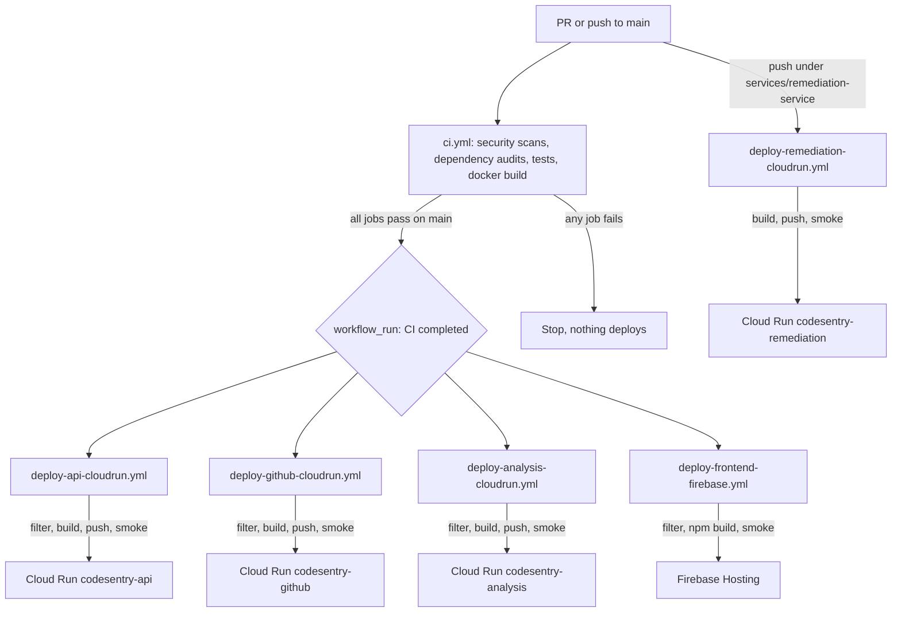

# CI/CD Pipeline

How code goes from a push to running in production. This is the high-level overview; for deploy mechanics (secrets, env vars, targets) see [Cloud Run and Firebase](./cloud-run-firebase.md).

## Overview

The pipeline has two stages:

1. **CI** (`.github/workflows/ci.yml`): the gate. Tests and security scans run on every PR and every push to `main`. Nothing is deployed here.
2. **Deploy**: five workflows, each deploying a single component and only if that component changed. Four of them start after CI succeeds on `main`; the remediation one is push-triggered.

Each deploy workflow first runs a `filter` job that skips the deploy if its component did not change. Cloud Run deploys use per-workflow concurrency, so repeat deploys for the same component are serialized.

## Stage 1: CI (the gate)

`ci.yml` triggers on any PR and any push to `main`. Every job runs in parallel, and **all must pass** or nothing deploys.

| Job | Purpose |
|---|---|
| `security-gitleaks` | Scans git history for leaked secrets. |
| `dependency-review` | PR-only. Flags newly added libraries with known high-severity vulnerabilities. |
| `npm-audit` | Runs `npm audit --audit-level=high` for frontend, API service, GitHub service, and JS proto packages. |
| `pip-audit` | Runs `pip-audit` for analysis service and Python proto packages. |
| `frontend-checks` | Frontend: install, lint, test, build. |
| `api-tests` | API service: install, lint, test, migration verification. |
| `github-service-tests` | GitHub service: install, lint, test. |
| `analysis-tests` | Analysis service (Python): install, bandit, pytest. |
| `remediation-integration-tests` | API service remediation integration suite against a disposable database. |
| `remediation-github-tests` | GitHub adapter remediation subset, including HTTP and gRPC transport parity. |
| `remediation-browser-tests` | Playwright remediation panel scenarios against the real Vite app with fixture API responses. |
| `docker-build` | Builds each backend image to confirm it is buildable. Does not push or deploy. |
| `ci-required` | Aggregator. This is the "Required CI" status the deploy workflows and branch rules key on. |

A separate `remediation.yml` workflow runs the remediation safety checks: the repair service pytest suite, the offline fixture and release evaluator gate, `terraform fmt -check`, `terraform validate` with no backend, and a Kustomize render with throwaway digests and private CIDRs. It never plans against a backend, never applies, and never runs `kubectl apply`. A daily `security-audit.yml` runs audit drift checks that do not gate deploys.

CI does not push images or deploy anything. It only proves the code is safe and the images build.

## Stage 2: Deploy

When CI finishes successfully on `main`, the four deploy workflows start (via `workflow_run`). Each can also be run manually with `workflow_dispatch`.

Every deploy workflow has two jobs:

- **`filter`**: checks whether this component's files changed in the latest commit. If not, the deploy is skipped.
- **`deploy`**: runs only if `filter` says yes. Backends build and push a Docker image to Artifact Registry, then deploy to Cloud Run; the frontend builds with npm and deploys to Firebase Hosting. Every deploy ends with a smoke check.

| Component | Target | Workflow |
|---|---|---|
| Frontend | Firebase Hosting | `deploy-frontend-firebase.yml` |
| API service | Cloud Run `codesentry-api` | `deploy-api-cloudrun.yml` |
| GitHub service | Cloud Run `codesentry-github` | `deploy-github-cloudrun.yml` |
| Analysis service | Cloud Run `codesentry-analysis` | `deploy-analysis-cloudrun.yml` |
| Remediation service | Cloud Run `codesentry-remediation` | `deploy-remediation-cloudrun.yml` |

The remediation workflow is the exception to the `workflow_run` pattern: it triggers directly on a push to `main` under `services/remediation-service/**`, so it does not wait for the CI aggregate. It deploys the single-instance development configuration.

## Key design choices

- **CI gates deploy.** The four original deploy workflows only start after CI passes on `main` (`workflow_run`). The remediation deploy is push-triggered and is not gated this way.
- **Path filtering.** Only the component that changed redeploys, so unrelated commits do not trigger full redeploys.
- **Per-component deploy serialization.** Each Cloud Run workflow has its own concurrency group (`cancel-in-progress: false`), so repeat deploys for the same component do not overlap.
- **Deploy the tested commit.** Deploys check out the exact commit CI ran on (`head_sha`), not the branch tip.
- **No stored cloud keys.** Backends authenticate to Google Cloud with Workload Identity Federation; runtime secrets come from Secret Manager.
- **SHA-pinned actions.** Every action is pinned to a commit SHA to guard against supply-chain tampering.
- **Smoke checks.** The API verifies `/health`; the frontend verifies the public site; gRPC services use Cloud Run startup/liveness probes plus service URL verification.
